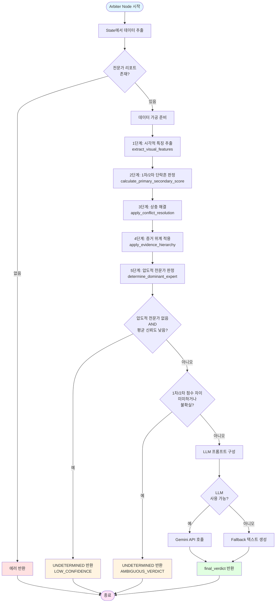

# Arbiter Node 워크플로우

## 개요

`node_arbiter` 함수는 모든 전문가(Contact, Deform, Necking)의 분석 결과를 종합하여 최종 결론을 도출하는 중앙 집중식 판정 노드입니다.

## 워크플로우 다이어그램



## 상세 단계 설명

### 입력 데이터 추출 (Lines 172-181)

```python
expert_reports = state.get("expert_reports", [])
expert_confidence_scores = state.get("expert_confidence_scores", {})
expert_evidence = state.get("expert_evidence", {})
expert_analysis_results = state.get("expert_analysis_results", {})
```

- **expert_reports**: 각 전문가의 텍스트 리포트 리스트
- **expert_confidence_scores**: 전문가별 신뢰도 점수 딕셔너리 (예: `{"contact": 85, "deform": 72}`)
- **expert_evidence**: 전문가별 증거 리스트 딕셔너리
- **expert_analysis_results**: 전문가별 구조화된 분석 결과 딕셔너리

### 1단계: 시각적 특징 추출 (Lines 210-213)

```python
visual_features = extract_visual_features(expert_analysis_results, expert_evidence)
```

**목적**: 각 전문가의 분석 결과에서 시각적 특징을 추출

**추출되는 특징**:
- `luster`: 광택 (high/low/matte)
- `porosity`: 기공 (high/low)
- `shape`: 형상 (spherical/irregular)
- `demarcation`: 경계 (sharp/gradual)
- `carbonization_location`: 탄화 위치 (localized/widespread)
- `surface_texture`: 표면 질감 (smooth/rough)

**데이터 소스**:
- `final_verdict_result.visual_description`
- `multi_hotspot_results[].specialist_result.visual_description`

### 2단계: 1차/2차 단락흔 판정 (Lines 215-230)

```python
primary_secondary_result = calculate_primary_secondary_score(
    visual_features,
    uncertainty_threshold=PRIMARY_SECONDARY_SCORE_DIFF_THRESHOLD  # 10점
)
```

**목적**: 단락흔이 화재의 원인(1차)인지 결과(2차)인지 판정

**판정 매트릭스** (`PRIMARY_VS_SECONDARY_MATRIX`):
- 각 특징별로 1차/2차 지표에 점수 부여
- 예: `shape: {"primary": {"spherical": 6}, "secondary": {"irregular": 6}}`

**결과**:
- `primary_score`: 1차 단락흔 점수
- `secondary_score`: 2차 단락흔 점수
- `determination`: "primary" | "secondary" | "uncertain" | "undetermined"
- `score_difference`: 점수 차이
- `observed_count`: 관측된 특징 개수

### 3단계: 상충 해결 (Lines 232-236)

```python
conflict_resolution = apply_conflict_resolution(
    expert_analysis_results, 
    expert_confidence_scores, 
    expert_evidence
)
```

**목적**: 전문가 간 상충하는 의견을 해결하고 신뢰도 점수 조정

**상충 해결 규칙** (`CONFLICT_RESOLUTION_RULES`):
1. **Case A: Tracking vs Aging** (현재 비활성화)
   - 흑연 광택이 있으면 Tracking 우선
   - Tracking 점수 × 1.2, Aging 점수 × 0.8

2. **Case B: Deform vs Necking** (활성화)
   - 압착 흔적이 명확하면 Deform 우선
   - Deform 점수 × 1.3, Necking 점수 × 0.7

3. **Case C: 형상 vs 표면**
   - 구형이지만 거칠면 2차 단락흔 의심
   - 1차 점수 × 0.7, 2차 점수 × 1.3

**결과**:
- `adjusted_scores`: 조정된 신뢰도 점수
- `conflicts`: 발견된 상충 리스트
- `resolutions`: 해결 방법 리스트

### 4단계: 증거 위계 적용 (Lines 238-243)

```python
hierarchy_result = apply_evidence_hierarchy(adjusted_scores, expert_evidence)
```

**목적**: 증거 유형에 따라 신뢰도 점수에 가중치 적용

**증거 위계** (`EVIDENCE_HIERARCHY`):
- `morphological_deformation`: 3.0 (형상학적 변형 - 압착)
- `chemical_composition`: 2.0 (화학적 성분 - 아산화동/흑연)
- `general_carbonization`: 1.0 (일반적 탄화)
- `insufficient_evidence`: 0.5 (증거 부족 - 페널티)

**결과**:
- `weighted_scores`: 가중치가 적용된 점수
- `evidence_types`: 각 전문가의 증거 유형

### 5단계: 압도적 전문가 판정 (Lines 248-257)

```python
dominance_result = determine_dominant_expert(
    weighted_scores,
    absolute_threshold=70.0,   # 70점 이상
    margin_threshold=15.0      # 2등과 15점 차이
)
```

**목적**: 압도적인 1위 전문가가 있는지 판정

**판정 조건**:
- 1위 점수 ≥ 70점 **AND** 1위와 2위 점수 차이 ≥ 15점
- → `is_determined = True`, `dominant_expert` 설정

**결과**:
- `dominant_expert`: 압도적 전문가 이름 (없으면 None)
- `max_score`: 최고 점수
- `second_score`: 2위 점수
- `margin`: 점수 격차
- `is_determined`: 압도적 1위 확정 여부

### 판단 보류(Undetermined) 체크

#### 체크 1: 낮은 신뢰도 (Lines 268-280)

```python
if not dominant_expert and (avg_confidence / 100.0 < threshold):
    return UNDETERMINED (LOW_CONFIDENCE)
```

**조건**: 압도적 전문가 없음 **AND** 평균 신뢰도 < 임계값

#### 체크 2: 모호한 판정 (Lines 321-335)

```python
if determination in ["uncertain", "undetermined"] or score_difference < PRIMARY_SECONDARY_SCORE_DIFF_THRESHOLD:
    return UNDETERMINED (AMBIGUOUS_VERDICT)
```

**조건**: 
- 판정이 "uncertain" 또는 "undetermined" **OR**
- 1차/2차 점수 차이 < 10점

### LLM 프롬프트 구성 및 호출 (Lines 337-467)

**프롬프트 구성 요소**:
1. 데이터 무결성 검증 지침 (원본 이미지 기반 검증)
2. 전문가 리포트
3. 전문가별 신뢰도 점수 (원본 및 증거 위계 적용 후)
4. 압도적 전문가 판정 결과
5. 전문가별 증거
6. 1차/2차 단락흔 판정 요약
7. 상충 해결 요약
8. 판단 보류 조건 (LLM이 다시 확인)
9. 판정 지시사항

**LLM 호출**:
- `client.models.generate_content()` 사용 (Gemini API)
- Fallback: `client`가 None이면 구조화된 텍스트 기반 종합 수행

## 출력

### 성공 시

```python
{
    "final_verdict": str  # 최종 결론 리포트 텍스트
}
```

### 실패 시

```python
{
    "errors": [str],      # 에러 메시지 리스트
    "final_verdict": None
}
```

### 판단 불가 시

```python
{
    "final_verdict": str,  # UNDETERMINED 리포트
    "errors": [str]        # 판단 불가 사유
}
```

## 주요 상수

- `PRIMARY_SECONDARY_SCORE_DIFF_THRESHOLD = 10`: 1차/2차 점수 차이 임계값
- `absolute_threshold = 70.0`: 압도적 전문가 최소 점수
- `margin_threshold = 15.0`: 압도적 전문가 최소 격차
- `config.ARBITER_CONFIDENCE_THRESHOLD`: 평균 신뢰도 임계값 (설정 파일에서)

## 특징

1. **계산 우선, 체크 후행**: 모든 계산을 먼저 수행한 후 판단 보류 체크
2. **다단계 필터링**: 낮은 신뢰도 → 모호한 판정 → LLM 최종 검증
3. **Fallback 지원**: LLM이 없어도 구조화된 텍스트 기반 종합 가능
4. **로깅**: 각 단계별 결과를 콘솔에 출력 (디버깅용)
