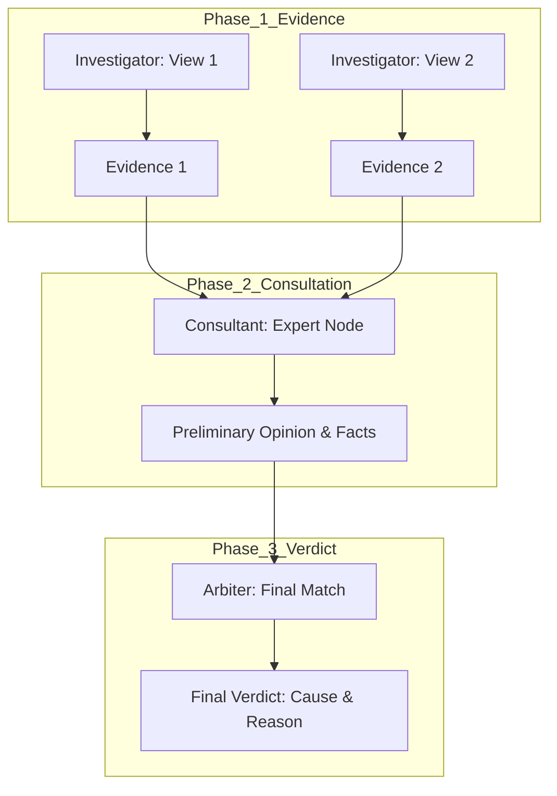

# [구현 계획서] 증거 우선주의 기반 법과학 분석 아키텍처 도입
## (Implementation Plan: Evidence-First Forensic Analysis)

본 문서는 `evidence_first_analysis_design.md`에 설계된 "증거 우선주의" 아키텍처를 실제 시스템에 구현하기 위한 단계별 로드맵입니다.

---

## 1. 개요 (Overview)
*   **목표:** 개별 전문가 모델의 독립적인 결론 도출 방식에서 탈피하여, **"객관적 시각 정보(Evidence) -> 전문적 소견(Opinion) -> 통합적 판정(Verdict)"**으로 흐르는 3단계 논리 구조를 구축함.
*   **핵심 가치:** 논리적 투명성(Transparency), 교차 검증 가능성(Cross-Validation), 분석의 추적성(Traceability).

---

## 2. 단계별 구현 계획 (Step-by-Step Roadmap)

### **Phase 1: 데이터 스키마 및 인터페이스 정의**
*   **목표:** 전문가 노드와 아비터 간의 통신 규약을 "결론 중심"에서 "증거 중심"으로 전환.
*   **세부 작업:**
    1.  `EvidenceItem` 데이터 클래스(또는 TypedDict) 정의:
        *   `hotspot_id`, `visual_fact` (String), `certainty` (Float 0~100)
    2.  `ExpertReport` 데이터 구조 설계:
        *   `expert_id`, `evidence_list` (List[EvidenceItem]), `preliminary_opinion`, `confidence`
    3.  LangGraph State에 `evidence_pool` (전체 증거 저장소) 필드 추가.

### **Phase 2: 조사관(Investigator) 노드 프롬프트 고도화**
*   **목표:** Worker 노드들이 성급한 결론을 내리지 않고 시각적 사실 기술에 집중하도록 수정.
*   **세부 작업:**
    1.  **Checklist 기반 프롬프트 도입:** 각 전문가 도메인(`Contact`, `Aging`, `Deform` 등)별로 반드시 확인해야 할 시각적 징후 리스트(예: 비드의 광택, 탄화 방향, 크랙 양상)를 프롬프트에 주입.
    2.  **출력 형식 강제:** "분석 결과" 대신 "관찰된 사실 리스트"를 반환하도록 Few-shot 예시 수정.
    3.  **수치화된 확신도 도출:** 육안으로 확인된 사실에 대한 확신도(Certainty of Fact)를 분리하여 보고하게 함.

### **Phase 3: 자문관(Consultant) 기반 Supervisor 노드 개편**
*   **목표:** 하위 Worker들의 증거를 취합하여 "자문 의견서" 필터링 및 요약.
*   **세부 작업:**
    1.  **증거 검토 로직:** Worker들이 중복으로 보고하거나 모순되게 보고한 시각적 사실들을 1차 정리.
    2.  **예비 소견(Preliminary Opinion) 작성:** 수집된 증거들이 해당 도메인(예: 접촉불량) 관점에서 어떤 의미를 갖는지 해석하는 텍스트 생성 로직 추가.
    3.  **도메인 신뢰도 계산:** 관찰된 증거들의 가중합을 통해 해당 원인일 가능성(Domain Confidence) 산출.

### **Phase 4: 아비터(Arbiter) - 최종 판정 엔진 고도화**
*   **목표:** 모든 전문가의 "검사 결과지"를 통합 분석하여 최종 원인 확정.
*   **세부 작업:**
    1.  **전역 증거 테이블 구성:** 아비터가 모든 노드에서 온 증거들을 한눈에 비교할 수 있는 Context 구성.
    2.  **교차 검증(Cross-Consultation) 로직:**
        *   A 전문가가 유리하다고 한 증거가 B 전문가의 원인과도 일치하는지 체크.
        *   전문가들 간의 상충되는 의견(Contradiction)을 해결하기 위한 심층 추론(Chain-of-Thought) 유도.
    3.  **최종 판정서(Final Verdict) 포맷팅:** 단순 결론이 아닌, "증거 A, B, C에 의해 원인 X로 판정함" 식의 논리 구조를 가진 리포트 생성.

### **Phase 5: 검증 및 운영 최적화**
*   **목표:** 시스템의 성능 지표 확인 및 추적성 검증.
*   **세부 작업:**
    1.  **Traceability 테스트:** 최종 결론에서부터 개별 시각 증거(Evidence ID)까지 역추적이 가능한지 QA.
    2.  **신뢰도 보정:** 실제 화재 사례 데이터를 통해 아비터의 가중치 및 임계값 조정.
    3.  **설명 가능성(XAI) 리포트 UI 반영:** 사용자에게 증거 기반의 분석 과정을 시각적으로 보여주는 기능 검토.

---

## 3. 예상 아키텍처 흐름도 (Mermaid)

---

## 4. 우선순위 및 일정 (Priority)

1.  **높음 (High):** 데이터 스키마 정의 및 Investigator 프롬프트 수정 (기존 흐름 유지하며 증거 추출 시작)
2.  **보통 (Medium):** 아비터 통합 판정 로직 고도화 (CoT 기반 추론 도입)
3.  **낮음 (Low):** UI 리포트 연동 및 설명 가능한 AI 기능 강화

---
**작성일:** 2026-03-19
**승인 상태:** 초안 검토 중
