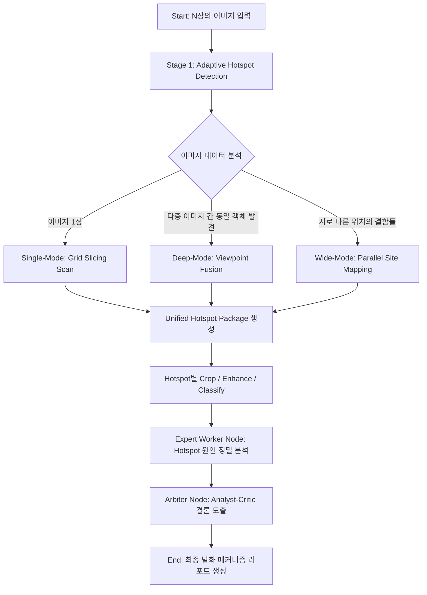

# [상세 설계 문서] 통합 하이브리드 화재 징후 분석 시스템
## (Integrated Hybrid Hotspot Analysis System: Single, Deep, and Wide)

### 1. 개요 (Overview)
본 시스템은 화재 현장의 시각 증거를 분석하여 발화 인과관계를 규명하는 차세대 AI 분석 엔진입니다. 단일 이미지의 정밀 스캔(Single), 동일 지점의 다각도 교차 분석(Deep), 그리고 현장 전반의 다중 지점 병렬 분석(Wide) 기능을 하나의 파이프라인으로 통합하여 법과학적 신뢰도를 극대화합니다.

---

### 2. 핵심 분석 시나리오 (Core Scenarios)

| 시나리오 | 분석 특징 (Strategy) | 이점 (Benefit) |
| :--- | :--- | :--- |
| **1. 단일 이미지 (Single)** | **Atomic Grid Slicing Scan** | 픽셀 단위의 미세한 결함(비드, 단락흔) 탐지 |
| **2. 다각도 사진 (Deep)** | **Cross-View Identity Fusion** | 사각지대 제거 및 입체적 검증을 통한 환각 억제 |
| **3. 다중 지점 사진 (Wide)** | **Global Scene Aggregation** | 현장 전체의 발화 경로 추적 및 상관관계 분석 |

---

### 3. 시스템 아키텍처 및 워크플로우 (Architecture & Workflow)

시스템은 **'관계 지향적 탐지(Relationship-aware Detection)'**와 **'사건 중심의 취합(Event-centric Reduction)'** 전략을 따릅니다.



---

### 4. 단계별 상세 프로세스 (Level-wise Process)

#### **Step 1: 적응형 핫스팟 탐지 (Adaptive Detection)**
*   **작동 원리:** 입력된 이미지들의 시각적 특징을 대조하여 동일 부위를 찍은 것인지, 서로 다른 지점인지를 판단합니다.
*   **결과 도출:** 
    *   동일 객체임이 확인되면 하나의 **Unified Hotspot ID**를 부여하고 각 이미지에서의 좌표 정보를 묶습니다.
    *   서로 다른 지점일 경우 개별적인 핫스팟으로 등록하여 독립적으로 관리합니다.

#### **Step 2: 통합 핫스팟 패키징 (Unified Packaging)**
*   전문가 노드가 분석하기 쉽도록 정보를 패키징합니다.
*   **데이터 구조 예시:**
    ```json
    {
      "id": "H-102",
      "source_images": ["cam_01.jpg", "cam_02_side.jpg"],
      "boxes": {
        "cam_01.jpg": {"ymin": 100, "xmin": 200, "ymax": 150, "xmax": 250},
        "cam_02_side.jpg": {"ymin": 450, "xmin": 500, "ymax": 550, "xmax": 600}
      },
      "roi_enhanced_paths": { ... },
      "component_type": "Terminal"
    }
    ```

#### **Step 3: 전문가 융합 분석 (Expert Fusion)**
*   담당 전문가(Contact, Necking 등)는 제공된 **모든 각도의 사진**을 증거로 활용합니다.
*   "정면 사진(A)에서는 용융 흔적이 보이고, 측면 사진(B)에서는 전선 간격의 협소함이 보이므로 '접촉 불량'으로 판정한다"와 같은 입체적 분석을 수행합니다.

#### **Step 4: 장면 종합 판정 (Scene Synthesis)**
*   아비터(Arbiter)가 모든 핫스팟(지점별 리포트)을 펼쳐놓고 상관관계를 분석합니다.
*   "거실 콘센트의 결함보다 주방 배전반의 손상이 일차적이므로 발화 기점은 주방이다"라는 최종 시나리오를 완성합니다.

---

### 5. 설계 시 기술적 고려사항 (Technical Guidelines)

1.  **API 동시성 제어:** 다중 이미지는 API 호출량이 많으므로 `src/utils/api_concurrency.py`의 세마포어를 통해 안정적인 처리를 보장해야 합니다.
2.  **보수적 판정 로직:** 다각도 분석 시, 단 한 장의 사진이라도 결함이 아님을 증명하면(Negative Proof) 의심 수준을 낮추는 법과학적 보수성을 유지합니다.
3.  **좌표 정규화:** 모든 좌표는 각 이미지의 해상도와 관계없이 0~1000 사이의 **상대 좌표**로 관리하여 데이터 일관성을 확보합니다.

---

### 6. 기대 효과 (Expected Outcome)
*   **정확도:** 다각도 교차 검증을 통한 환각 현상(Hallucination) 획기적 감소.
*   **범용성:** 단순 단락흔 분석부터 대규모 화재 현장의 정밀 감식까지 광범위하게 적용 가능.
*   **신뢰성:** 각 증거 지점별 리포트와 현장 전체의 시나리오를 동시에 제공하여 법적/사회적 공신력 확보.
